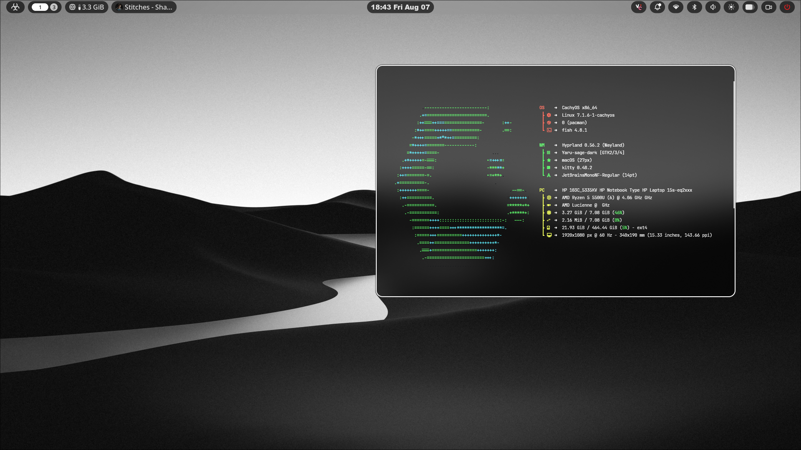

<div align="center">



# dexrice

**A clean, minimal Hyprland setup for Arch Linux, powered by Noctalia.**

[](https://archlinux.org)
[](https://hyprland.org)
[](https://docs.noctalia.dev)

</div>

---

## About

These are my personal dotfiles for a minimal, keyboard-driven Hyprland desktop on Arch Linux. Everything here is symlinked.

**Highlights**

- Scrolling-tiling layout, minimal gaps, soft rounded corners
- Custom Noctalia bar layout, control center, and color scheme
- Several kitty themes included (Catppuccin, Tokyo Night, Cyberdream, Oxocarbon)
- Hardware-agnostic monitor config: Hyprland auto-detects your display, no editing required
- Fallback launcher scripts (e.g. browser picker checks for Brave → Firefox → Zen → Vivaldi → LibreWolf, whichever is installed)

## Requirements

- Arch Linux (or an Arch-based distro with `pacman`)
- A non-root user with `sudo` access

## Installation

This assumes Hyprland, Noctalia, and everything else are already installed. The script only symlinks the dotfiles into `~/.config`, it doesn't install packages.

```bash
git clone https://github.com/ishmweet/dexrice.git
cd dexrice
./install.sh
```

Must be run **from inside the cloned repo**, since it resolves paths relative to its own location.

Preview what it'll do first, without changing anything:

```bash
./install.sh --dry-run
```

Safe to re-run. It backs up anything it'd overwrite to `~/.config-backup/<timestamp>/` first.

## Notes

- `hypr/keybinds.conf` binds the editor key to VS Code (`code`) by default. Change the `$EDITOR` variable if you use something else.
- `fish/config.fish` includes a few personal project aliases (`cdv`, `cdf`, `cdn`, `cdp`, `cdb`, `agy`, `vel`) pointing at my own repos. Harmless if unused, feel free to delete them.
- On Nvidia, uncomment the Nvidia environment block in `hypr/startup.conf`.
- After installing, log out and back into Hyprland (or reboot) to pick everything up.
